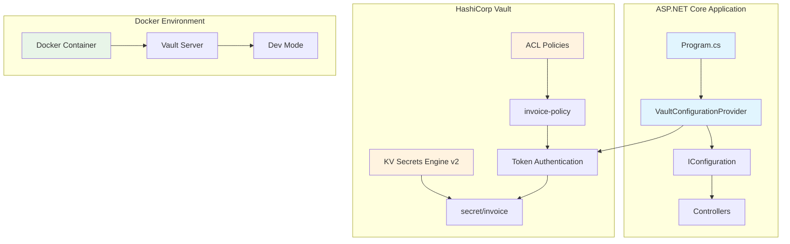
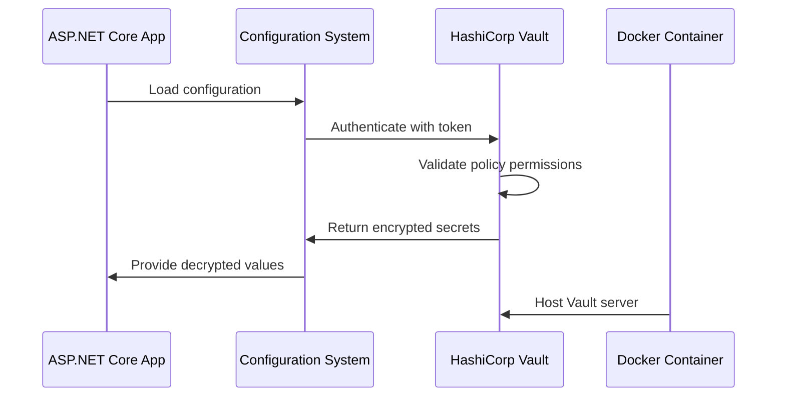
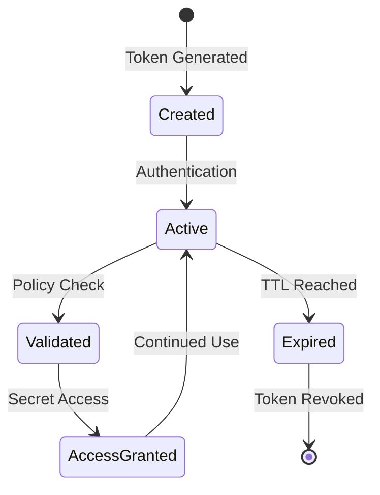

# VaultSharp .NET Integration with HashiCorp Vault

A complete implementation of secure secret management in ASP.NET Core using VaultSharp and HashiCorp Vault, featuring role-based access control and best practices.

## Table of Contents

- [Overview](#overview)
- [Architecture](#architecture)
- [Prerequisites](#prerequisites)
- [Quick Start](#quick-start)
- [Vault Setup](#vault-setup)
- [Application Configuration](#application-configuration)
- [Security Implementation](#security-implementation)
- [API Usage](#api-usage)
- [Troubleshooting](#troubleshooting)
- [Best Practices](#best-practices)

## Overview

This project demonstrates how to integrate HashiCorp Vault with ASP.NET Core applications using VaultSharp, a lightweight .NET client library. The implementation includes:

- **Secure Secret Storage**: Centralized management of sensitive data
- **Role-Based Access Control**: Granular permissions using Vault policies
- **Configuration as Code**: Secrets loaded into .NET configuration system
- **Development to Production**: Consistent setup across environments

### Key Features

- 🔐 **Token-based Authentication** with restricted permissions
- 🛡️ **ACL Policies** for fine-grained access control
- 🔄 **Configuration Reload** without application restart
- 📊 **KV Secrets Engine v2** for versioning support
- 🚀 **ASP.NET Core Integration** via custom configuration provider

## Architecture



### Data Flow



## Prerequisites

- **Docker & Docker Compose** (for Vault server)
- **.NET 8.0 SDK** (or later)
- **Visual Studio Code** or preferred IDE
- **Basic knowledge** of ASP.NET Core and Docker

### System Requirements

- **OS**: macOS, Linux, or Windows
- **RAM**: 2GB minimum (4GB recommended)
- **Disk**: 1GB free space
- **Network**: Internet access for NuGet packages

## Quick Start

1. **Clone the repository**

   ```bash
   git clone https://github.com/khanhtranmimh/VaultSharpDotnet.git
   cd VaultSharpDotnet
   ```

2. **Start Vault server**

   ```bash
   docker run -d --name hashicorp_vault \
     --cap-add=IPC_LOCK \
     -e 'VAULT_DEV_ROOT_TOKEN_ID=myroot' \
     -e 'VAULT_DEV_LISTEN_ADDRESS=0.0.0.0:8200' \
     -p 8200:8200 hashicorp/vault
   ```

3. **Configure secrets**

   ```bash
   # Create invoice secret
   curl -H "X-Vault-Token: myroot" \
        -X POST \
        -d '{"data":{"username":"invoice_user","password":"secure123"}}' \
        http://localhost:8200/v1/secret/data/invoice
   ```

4. **Run the application**

   ```bash
   cd VaultSharpDotnet
   dotnet restore
   dotnet run
   ```

5. **Access the API**
   - Swagger UI: <http://localhost:5000/swagger>
   - Weather API: <http://localhost:5000/WeatherForecast>

## Vault Setup

### 1. Start Vault in Development Mode

```bash
docker run -d --restart unless-stopped --name hashicorp_vault \
  --cap-add=IPC_LOCK \
  -e 'VAULT_DEV_ROOT_TOKEN_ID=myroot' \
  -e 'VAULT_DEV_LISTEN_ADDRESS=0.0.0.0:8200' \
  -p 8200:8200 \
  hashicorp/vault
```

**Important**: The `VAULT_DEV_LISTEN_ADDRESS=0.0.0.0:8200` is crucial for Docker networking.

### 2. Access Vault UI

- **URL**: <http://localhost:8200>
- **Token**: `myroot` (from VAULT_DEV_ROOT_TOKEN_ID)

### 3. Create ACL Policy

Create `invoice-policy.hcl`:

```hcl
path "secret/data/invoice" {
  capabilities = ["create", "read", "update", "delete"]
}
```

Load the policy:

```bash
docker cp invoice-policy.hcl hashicorp_vault:/tmp/
docker exec hashicorp_vault vault policy write invoice-policy /tmp/invoice-policy.hcl
```

### 4. Create Restricted Token

```bash
curl -H "X-Vault-Token: myroot" \
     -X POST \
     -d '{"policies": ["invoice-policy"], "ttl": "768h"}' \
     http://localhost:8200/v1/auth/token/create
```

Use the returned `client_token` in your application.

### 5. Create Secrets

```bash
curl -H "X-Vault-Token: <your-token>" \
     -X POST \
     -d '{"data":{"username":"invoice_user","password":"secure123"}}' \
     http://localhost:8200/v1/secret/data/invoice
```

## Application Configuration

### appsettings.json

```json
{
  "Vault": {
    "Address": "http://localhost:8200",
    "Secret": "hvs.CAESI...",  // Your restricted token
    "Role": "",
    "MountPath": "",
    "SecretType": ""
  }
}
```

### Program.cs Integration

```csharp
public static IHostBuilder CreateHostBuilder(string[] args) =>
    Host.CreateDefaultBuilder(args)
        .ConfigureAppConfiguration((hostingContext, config) =>
        {
            config.AddJsonFile("appsettings.json", optional: false, reloadOnChange: true);
            config.AddEnvironmentVariables(prefix: "VAULT_");

            var builtConfig = config.Build();

            config.AddVault(options =>
            {
                var vaultOptions = builtConfig.GetSection("Vault");
                options.Address = vaultOptions["Address"];
                options.Secret = vaultOptions["Secret"];
            });
        })
        .ConfigureWebHostDefaults(webBuilder =>
        {
            webBuilder.UseStartup<Startup>();
        });
```

### Custom Configuration Provider

The `VaultConfigurationProvider` automatically loads secrets from `secret/invoice` into the configuration system.

## Security Implementation

### Access Control Matrix

| Role | secret/invoice | secret/database | secret/tvan |
|------|----------------|-----------------|-------------|
| Root Token | ✅ Full Access | ✅ Full Access | ✅ Full Access |
| Invoice Token | ✅ CRUD | ❌ Denied | ❌ Denied |
| Database Token | ❌ Denied | ✅ CRUD | ❌ Denied |

### Token Lifecycle



### Encryption at Rest

- **Vault Storage**: All secrets encrypted using AES-256-GCM
- **Key Management**: Auto-unseal in dev mode (production uses HSM)
- **Network**: TLS encryption (disabled in dev mode)

## API Usage

### Weather Forecast API

```http
GET /WeatherForecast
```

Returns sample weather data. The endpoint demonstrates that the application starts successfully with Vault integration.

### Configuration Access

In controllers, access Vault secrets via `IConfiguration`:

```csharp
public class InvoiceController : ControllerBase
{
    private readonly IConfiguration _config;

    public InvoiceController(IConfiguration config)
    {
        _config = config;
    }

    [HttpGet("credentials")]
    public IActionResult GetCredentials()
    {
        var username = _config["username"];
        var password = _config["password"];
        return Ok(new { username, password });
    }
}
```

## Troubleshooting

### Common Issues

#### 1. "localhost:8200 connection refused"

**Cause**: Vault container not listening on correct interface.

**Fix**: Ensure `VAULT_DEV_LISTEN_ADDRESS=0.0.0.0:8200` in Docker run command.

#### 2. "permission denied" when accessing secrets

**Cause**: Token lacks required policy permissions.

**Fix**: Verify token has correct policies attached.

#### 3. Application fails to start

**Cause**: Invalid Vault configuration or unreachable server.

**Fix**: Check `appsettings.json` and ensure Vault is running.

#### 4. NuGet restore fails

**Fix**: Use public NuGet source only:

```bash
dotnet restore --source https://api.nuget.org/v3/index.json
```

### Debug Commands

```bash
# Check Vault status
docker exec hashicorp_vault vault status

# List policies
docker exec hashicorp_vault vault policy list

### Debug Commands

```bash
# Check Vault status
docker exec hashicorp_vault vault status

# List policies
docker exec hashicorp_vault vault policy list

# Read secret manually
curl -H "X-Vault-Token: <token>" http://localhost:8200/v1/secret/data/invoice
```

## Best Practices

### Security

- 🔐 **Never use root tokens** in production applications
- 🛡️ **Implement least privilege** with granular policies
- 🔄 **Rotate tokens regularly** using short TTLs
- 📝 **Audit access logs** for suspicious activity
- 🚫 **Disable dev mode** in production environments

### Development

- 🐳 **Use Docker** for consistent Vault environments
- 📋 **Version control policies** as code (HCL files)
- 🔧 **Environment-specific configs** for dev/staging/prod
- 🧪 **Test with mock secrets** in unit tests
- 📊 **Monitor token usage** and expiration

### Production Deployment

- 🏗️ **Use Vault clusters** with auto-unseal
- 🔑 **Integrate with identity providers** (LDAP, OIDC)
- 📈 **Enable audit logging** and monitoring
- 🔒 **Use TLS certificates** for all communications
- 💾 **Implement backup strategies** for secrets

### Performance

- ⚡ **Cache secrets** in application memory
- 🔄 **Implement refresh mechanisms** for secret updates
- 📊 **Monitor API rate limits** and usage patterns
- 🏗️ **Use connection pooling** for high-traffic apps

---

## Contributing

1. Fork the repository
2. Create a feature branch
3. Make your changes
4. Add tests if applicable
5. Submit a pull request

## License

This project is licensed under the MIT License - see the LICENSE file for details.

## References

- [VaultSharp GitHub](https://github.com/rajanadar/VaultSharp)
- [HashiCorp Vault Documentation](https://developer.hashicorp.com/vault)
- [ASP.NET Core Configuration](https://docs.microsoft.com/en-us/aspnet/core/fundamentals/configuration)
